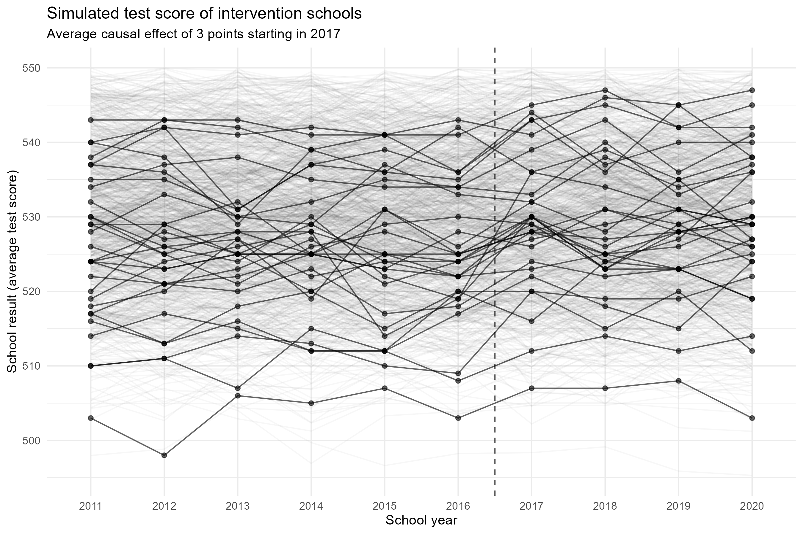
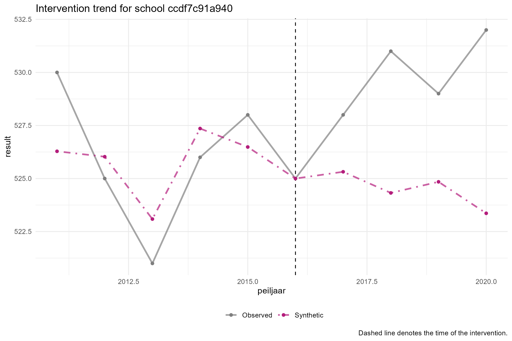
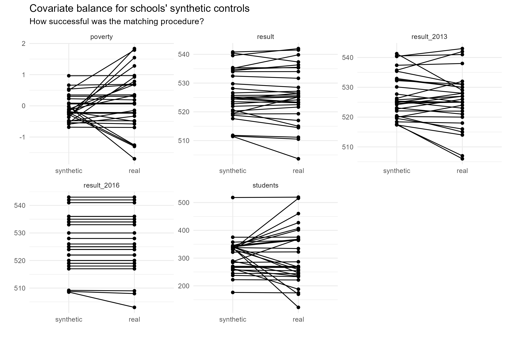

# Disaggregated synthetic control simulation
In this repository, we simulate data on a school intervention and we try to recover the average causal effect using a disaggregated synthetic control method. In this method, we create a synthetic control for each school and then average over schools.

The script [`01_simulate_data.R`](./01_simulate_data.R) contains the code to create the simulated school data, which results in the following simulated effect:

The script [`02_disaggregated_synthetic_control.R`](./02_disaggregated_synthetic_control.R) contains the code to analyse this data and produce school-level effect plots like this:

Additionally, there is code to investigate covariate balance for the schools:

## Contact
This is a project by the [ODISSEI Social Data Science (SoDa)](https://odissei-data.nl/nl/soda/) team.
Do you have questions, suggestions, or remarks on the technical implementation? File an issue in the
issue tracker or feel free to contact [Erik-Jan van Kesteren](https://github.com/vankesteren).

 
